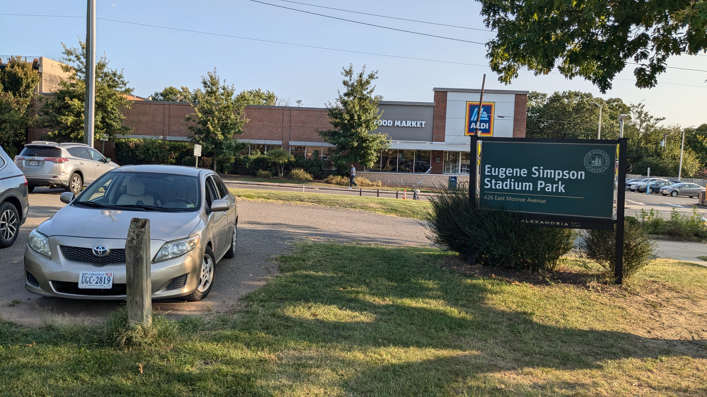
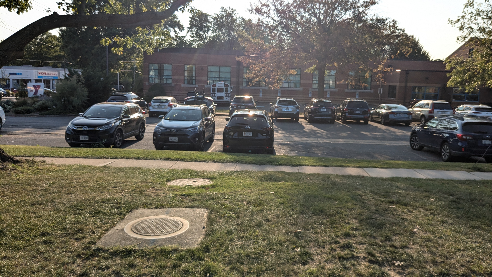

Dear Director Castaneda,

We support budgeting for and creating a glass recycling dropoff location, either on Main Line Boulevard between the George Washington Middle School football field and the Metro tracks or in Eugene Simpson Park.   We have developed this idea in close and deeply appreciated coordination with city staff.  We are particularly thankful for Gary Hensley's coordination of that dialog.  We talked to Parking Board Chair Jimmy Lewis who was supportive of using two parking spaces for a drop off on Main Line Boulevard.
Separating glass from other recycling streams allows Northern Virginia to put used glass to good use and reduces costs.  We are delighted that the program is “[A truly smashing success that has shattered expectations](https://www.fairfaxcounty.gov/news/glass-recycling-a-smashing-success)” and want ourselves and our neighbors to have a more convenient way to participate to help reduce city waste management costs while making good use of natural resources.

Both proposed locations for a new drop off are far closer to Del Ray and North Old Town than any existing drop off, but far enough from residences to avoid creating a nuisance for neighbors.  City staff sound optimistic that the Main Line Boulevard location is feasible and noted that Simpson Park is more complicated because of its ongoing renovation.  The Main Line Boulevard location is between the Metro tracks and the George Washington Middle School football field and would repurpose the last parking spaces on the east side of Main Line Boulevard before it dead ends.  It has no impact on the Eugene Simpson Park renovation. The Eugene Simpson Park location seems even more attractive. It is far from homes, visible from a main street (Monroe Avenue), and close to shopping areas that residents regularly visit for other reasons.  If neither of these are feasible, we welcome other nearby options.

The map below shows the two options as purple dots.  The map also shows 1-mile rings around existing drop off locations.  Darker census block groups have higher population density.  An interactive version of this map is online at [alx-glass.github.io](https://alx-glass.github.io/).  The new drop off would serve heavily populated neighborhoods including Del Ray, Rosemont, and North Old town that are distant from existing drop off locations.

## Photos of the proposed Main Line Boulevard location:
 	 
	
 	 
Facing west, where the site backs up to athletic fields.	Facing north, where the site is adjacent to athletic fields and the nearest residences are more than 100 yards away.

 <table>
        <tr>
            <td></td>
            <td></td>
        </tr>
        <tr>
            <td>Facing the east, where the site backs up to busy railroad and metro tracks.</td>
            <td>Facing south, where the site is also adjacent to railroad and Metro tracks.</td>
        </tr>
        <tr>
            <td></td>
            <td></td>
        </tr>
        <tr>
            <td>Facing west, where the site backs up to athletic fields.</td>
            <td>Facing north, where the site backs up to athletic fields and the nearest buildings are more than 100 yards away.</td>
        </tr>
</table>

## Conceptual Photos of a Simpson Park Location:

Our discussions with city staff did not identify a specific location in Simpson Park. These photos show the attractive features of Simpson Park locations near Monroe Avenue. We are open to other locations.

 <table>
        <tr>
            <td></td>
            <td></td>
        </tr>
        <tr>
            <td>Facing the east, where the site backs up to athletic fields and Route 1 and train tracks beyond the fields.	</td>
            <td>Facing south, where the site backs up to Monroe Avenue -- an arterial street -- and a shopping center.   This location is convenient for Aldi and CVS shoppers.</td>
        </tr>
        <tr>
            <td></td>
            <td></td>
        </tr>
        <tr>
            <td>Facing west, where the site backs up to the YMCA.  This site is convenient for YMCA patrons.</td>
            <td>Facing north, where the site backs up to athletic fields.</td>
        </tr>
</table>

 	 
An additional drop off would increase our satisfaction and participation.  Some of us find the existing locations so inconvenient that we cannot justify participating. Others stockpile glass for months until a trip takes us near a drop off and sometimes throw glass in the garbage if our home storage fills up. Key goals of recycling include reducing carbon emissions and air pollution, so extra driving just to recycle detracts from the program's value.  

[City materials](https://media.alexandriava.gov/docs-archives/tes/solidwaste/glassmailerv7.pdf) promoting the glass recycling program emphasize that participation is the "Least expensive, most sustainable option."  We hope that a new drop off would increase participation in the program enough to pay for itself with direct savings and environmental benefits within a few years and welcome dialog with city staff about ways to revise or rethink our proposal to ensure that it is cost effective.
We appreciate the hard work that city staff and leaders do to make Alexandria a great place to live and would appreciate a budget that makes cost effective improvements to the glass recycling program that better serve program users, Alexandria citizens, and the planet. 

