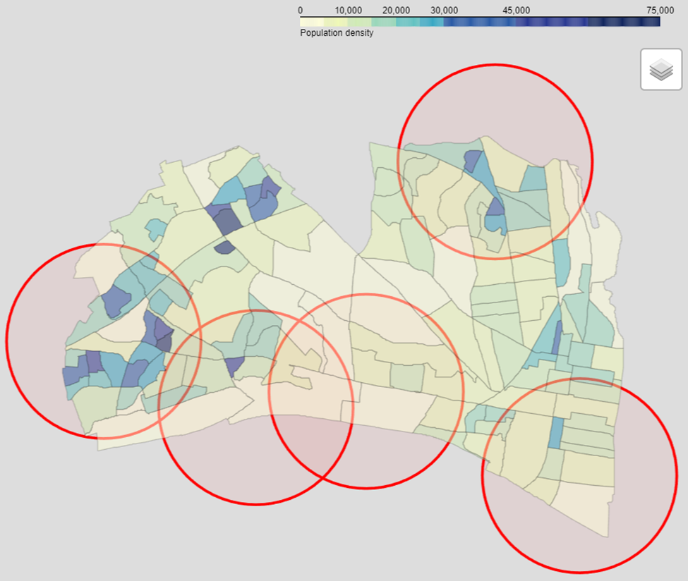

We support separating glass from other recycling streams so Northern Virginia can put used glass to good use and reduce costs.   We are delighted that the program is “[A truly smashing success that has shattered expectations](https://www.fairfaxcounty.gov/news/glass-recycling-a-smashing-success)” and want to participate in both using and providing feedback to the program to help reduce city waste management costs while making good use of natural resources.

There may be an opportunity to make the program even more successful by increasing program visibility with signs directing users to drop offs from main streets and by bringing drop offs closer to specific neighborhoods including our own. Some of us find the existing locations so inconvenient that we cannot justify participating. Others stockpile glass for months until a trip takes us near a drop off and sometimes discard glass if our home storage fills up. Key goals of recycling include reducing carbon emissions and air pollution, so extra driving just to recycle detracts from the program's value and is hard for participants to justify.  

The map below shows drop off locations, 1 mile rings around them, and population density.  An interactive version of this map is online at [alx-glass.github.io](https://alx-glass.github.io/).  It confirms our intuition that the city drop offs are not convenient to a number of heavily populated neighborhoods including Del Ray, Rosemont, North Old town and the Southern Towers. Adding more convenient drop off locations would increase our satisfaction and participation.

It might be possible to add a drop off on underused public or private asphalt that is far closer to Del Ray and North Old Town than any existing drop off, but far enough from any individual residence.  The Eugene Simpson Park parking lot seems attractive because it is far from homes, on and visible from a main street (Monroe Avenue), and close to shopping.  The last parking spaces on the east side of Main Line Boulevard before it dead ends between the Metro tracks and George Washington Middle School are less convenient, but are also an appropriately isolated option. 

We would like to discuss the feasibility of incremental improvements to the program like 1) improving signage and 2) improving the convenience of drop off locations.

We appreciate the hard work that city staff and leaders do to make Alexandria a great place to live and would welcome a chance to better understand the program and to lend both our experience as citizens and our expertise to help identify feasible, incremental changes that lead to cost effective improvements that better serve program users, Alexandria citizens, and the planet. 
