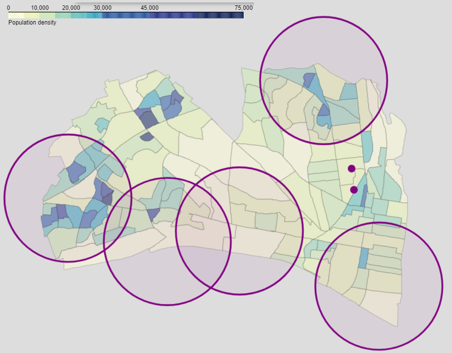

We support separating glass from other recycling streams so Northern Virginia can put used glass to good use and reduce costs.   We are delighted that the program is “[A truly smashing success that has shattered expectations](https://www.fairfaxcounty.gov/news/glass-recycling-a-smashing-success)” and want to participate.

There may be an opportunity to make the program even more successful by adding signs that increase the visibility of glass drop offs on main streets and by bringing drop offs closer to specific neighborhoods including our own. As a result, some of us find the existing locations so inconvenient that we cannot justify participating. Others stockpile glass for months until a trip takes them near a drop off and sometimes discard glass if our storage fills up. Key goals of recycling include reducing carbon emissions and air pollution, so extra driving just to recycle detracts from the program's value and is both hard for us to justify.  

The map below shows drop off locations, 1 mile rings around them, and population density.  An interactive version of this map is online at [alx-glass.github.io](https://alx-glass.github.io/).  It confirms our intuition that the city drop offs are not convenient to a number of heavily populated neighborhoods including Del Ray, Rosemont, North Old town and the Southern Towers. Adding drop off locations in these areas would increase our satisfaction and participation.

The Arlington County Trades Center drop off in Shirlington is closer to some neighborhoods than any Alexandria drop off, but the Arlington signs and website say their drop offs are “Available to [Arlington] residents.” 

It might be possible to add a drop off on underused public and private asphalt that is far closer to Del Ray and North Old Town than any existing drop off, but far enough from any individual residence.  The Eugene Simpson Park parking lot seems attractive because it is far from homes, on and visible from a main street (Monroe Avenue), and close to shopping.  The last parking spaces on the east side of Main Line Boulevard before it dead ends are less convenient, but are also an appropriately isolated option since they are surrounded by train tracks, parking lots and athletic fields. 

We would like to discuss the feasibility of incremental improvements to the program like 1) increasing the visibility of drop offs with signs directing citizens from major streets to drop off facilities and 2) locating drop off locations convenient to where large numbers of Alexandrians live, shop, or commute.

We appreciate the hard work that city staff and leaders do to make Alexandria a great place to live and would welcome a chance to better understand the program and seek feasible, incremental changes that lead to cost effective improvements that better serve program users, Alexandria citizens, and the planet. 